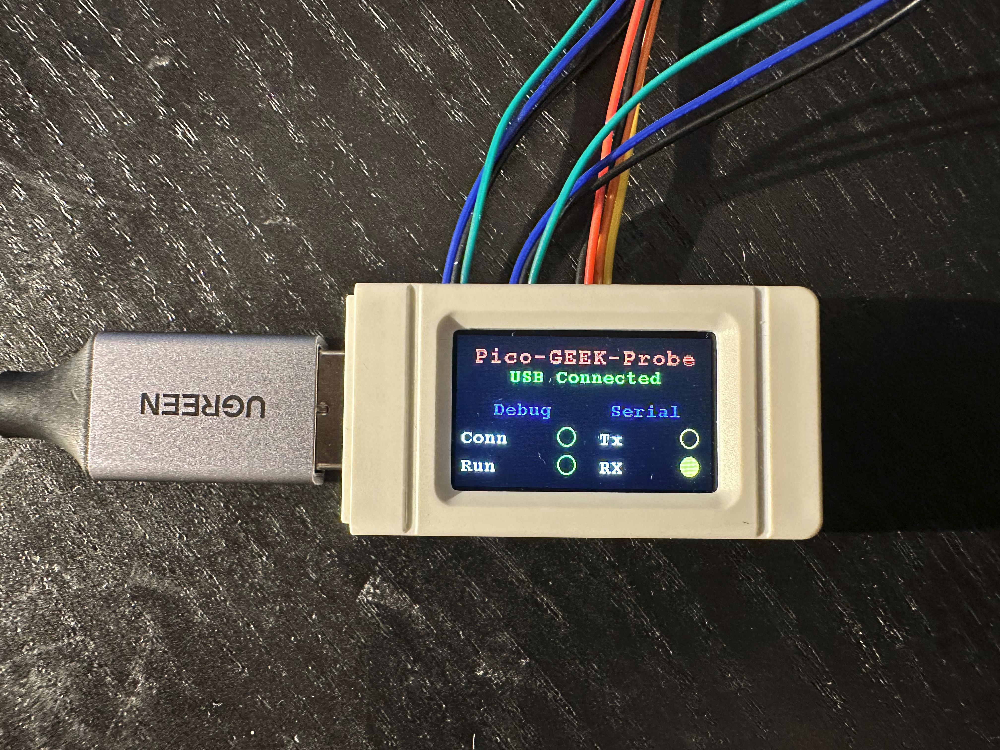
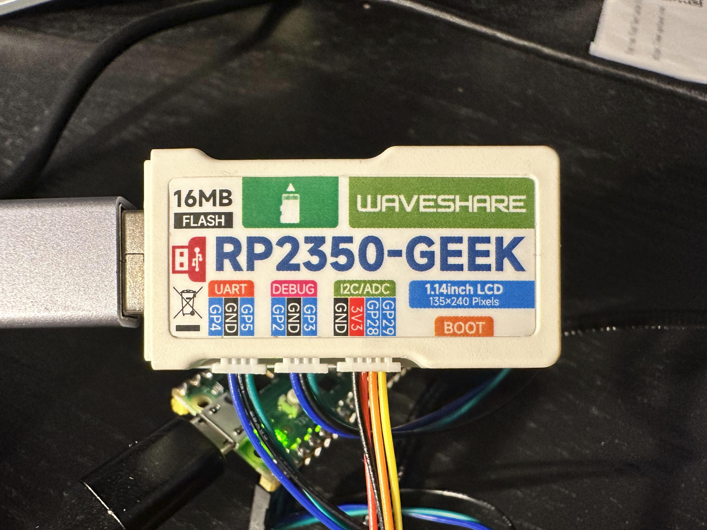

# RP2350-GEEK

The main aim of this fork is to add GUI support to the probe project. Fixes add some code to the main line and it may be problematic to create a PR to the original repo.

## Pinout

UART
- GP4 TX (->)
- GP5 RX (<-)

Debug
- GP2 SWCLK
- GP3 SWDIO

## References

- https://www.waveshare.com/wiki/RP2350-GEEK
- https://github.com/raspberrypi/debugprobe

## Photos

